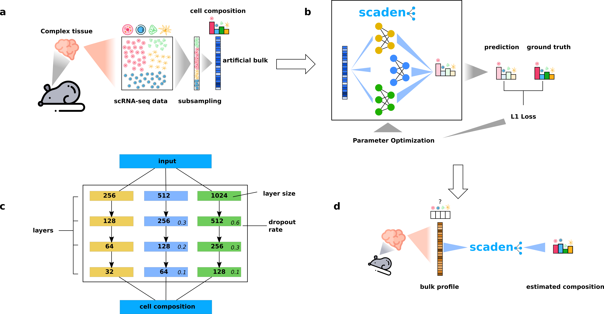

## Single-cell assisted deconvolutional network

Scaden is a deep-learning based algorithm for cell type deconvolution of bulk RNA-seq samples. It was developed 
at the DZNE Tübingen and the ZMNH in Hamburg. 
The method is published in Science Advances:
 [Deep-learning based cell composition analysis from tissue expression profiles](https://advances.sciencemag.org/content/6/30/eaba2619)

A complete documentation is available [here](https://scaden.readthedocs.io)




Scaden overview. a) Generation of artificial bulk samples with known cell type composition from scRNA-seq data. b) Training 
of Scaden model ensemble on simulated training data. c) Scaden ensemble architecture. d) A trained Scaden model can be used
to deconvolve complex bulk mixtures.


## Installation guide
Scaden can be easily installed on a Linux system, and should also work on Mac. 
There are currently two options for installing Scaden, either using [Bioconda](https://bioconda.github.io/) or via [pip](https://pypi.org/).

### pip
To install Scaden via pip, simply run the following command:

`pip install scaden`


### Bioconda
You can also install Scaden via bioconda, using:

`conda install -c bioconda scaden`

### GPU
If you want to make use of your GPU, you will have to additionally install `tensorflow-gpu`.

For pip:

`pip install tensorflow-gpu`

For conda:

`conda install tensorflow-gpu`

### Docker
If you don't want to install Scaden at all, but rather use a Docker container, we provide that as well.
For every release, we provide two version - one for CPU and one for GPU usage.
To pull the CPU container, use this command:

`docker pull ghcr.io/kevinmenden/scaden/scaden`

For the GPU container:

`docker pull ghcr.io/kevinmenden/scaden/scaden-gpu`

### Webtool (beta)
Additionally, we now proivde a web tool:

[https://scaden.ims.bio](https://scaden.ims.bio)

It contains pre-generated training datasets for several tissues, and all you need to do is to upload your expression data. Please note that this is still in preview.

## Usage
We provide a detailed instructions for how to use Scaden at our [Documentation page](https://scaden.readthedocs.io/en/latest/usage/)

A deconvolution workflow with Scaden consists of four major steps:
* data simulation
* data processing
* training
* prediction

If training data is already available, you can start at the data processing step. Otherwise you will first have to process scRNA-seq datasets and perform data simulation to generate a training dataset. As an example workflow, you can use Scaden's function `scaden example` to generate example data and go through the whole pipeline.

First, make an example data directory and generate the example data:
```bash
mkdir example_data
scaden example --out example_data/
```
This generates the files "example_counts.txt", "example_celltypes.txt" and "example_bulk_data.txt" in the "example_data" directory. Next, you can generate training data:

```bash
scaden simulate --data example_data/ -n 100 --pattern "*_counts.txt
```

This generates 100 samples of training data in your current working directory. The file you need for your next step is called "data.h5ad". Now you need to perform the preprocessing using the training data and the bulk data file:

```bash
scaden process data.h5ad example_data/example_bulk_data.txt
```

As a result, you should now have a file called "processed.h5ad" in your directory. Now you can perform training. The following command performs training for 5000 steps per model and saves the trained weights to the "model" directory, which will be created:

```bash
scaden train processed.h5ad --steps 5000 --model_dir model
```

Finally, you can use the trained model to perform prediction:

```bash
scaden predict --model_dir model example_data/example_bulk_data.txt
```

Now you should have a file called "scaden_predictions.txt" in your working directory, which contains your estimated cell compositions.


### 1. System requirements
Scaden was developed and tested on Linux (Ubuntu 16.04 and 18.04). It was not tested on Windows or Mac, but should
also be usable on these systems when installing with Pip or Bioconda. Scaden does not require any special
hardware (e.g. GPU), however we recommend to have at least 16 GB of memory.

Scaden requires Python 3. All package dependencies should be handled automatically when installing with pip or conda.